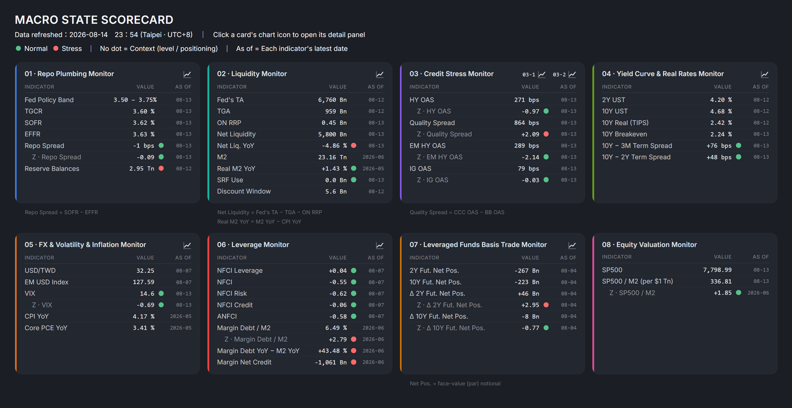
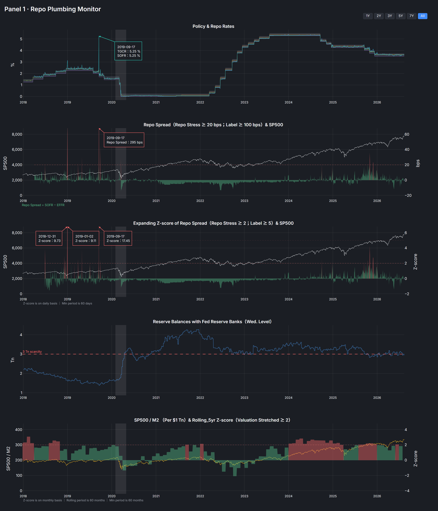
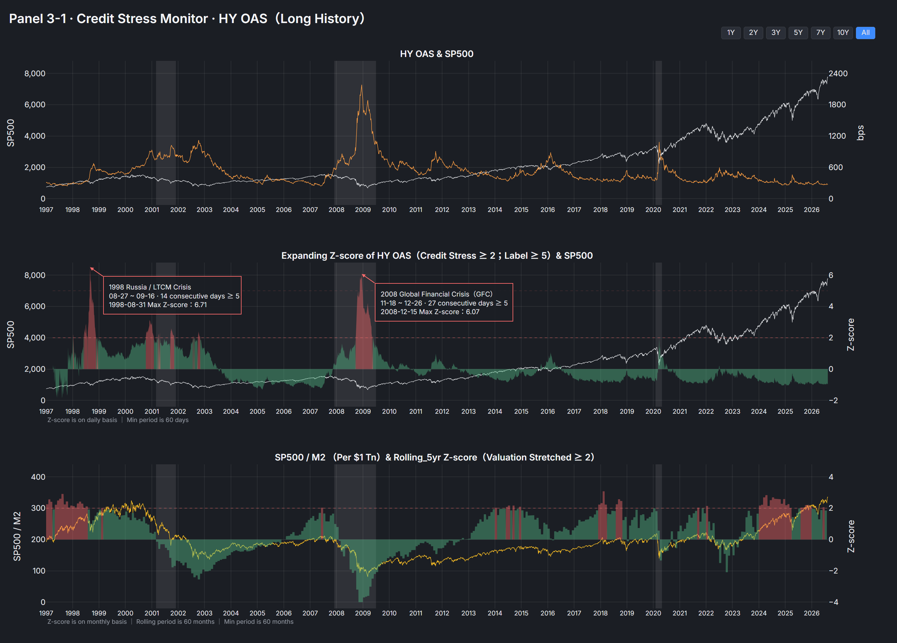
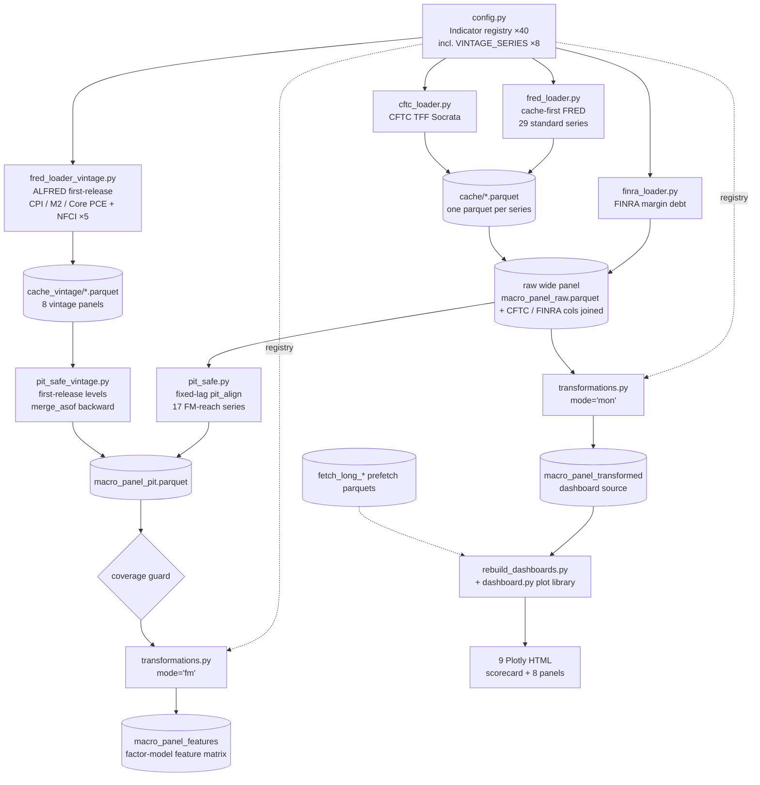

# Macro Liquidity Pipeline

A production-grade US macro-liquidity monitoring and **PIT-safe feature pipeline**: 40 indicators across 9 blocks (repo plumbing, Fed balance-sheet liquidity, credit, curve, volatility, leverage, FX, macro, CFTC positioning), sourced from FRED / ALFRED / CFTC / FINRA, cached locally, aligned point-in-time, and published as two independent outputs — an un-lagged monitoring panel that feeds a 9-page Plotly dashboard suite, and a strictly point-in-time feature matrix for cross-sectional factor research.

**Live dashboards:** [Macro State Scorecard](https://lauren-shih.github.io/macro-liquidity-pipeline/dashboards/00_macro_scorecard.html) — front page linking all eight panels (repo plumbing · net liquidity · credit stress ×2 · yield curve · FX/vol/inflation · leverage · leveraged-funds basis trade).

**Docs:** [Architecture](https://lauren-shih.github.io/macro-liquidity-pipeline/01_Architecture.html) · [Integration (consumer spec)](https://lauren-shih.github.io/macro-liquidity-pipeline/02_Integration.html) · [Macro DB Ingest — Design](https://lauren-shih.github.io/macro-liquidity-pipeline/03_Macro_DB_Ingest_Design.html)



<p>
  
  
</p>

## 📖 Reading guide

Suggested order for a first read: this README → **[01 Architecture](https://lauren-shih.github.io/macro-liquidity-pipeline/01_Architecture.html)** (what the pipeline is: modules, data flow, PIT design) → **[02 Integration](https://lauren-shih.github.io/macro-liquidity-pipeline/02_Integration.html)** (the consumer contract: how downstream research consumes the features parquet) → **[03 Macro DB Ingest Design](https://lauren-shih.github.io/macro-liquidity-pipeline/03_Macro_DB_Ingest_Design.html)** (a designed warehouse extension; the research path deliberately consumes Parquet with zero DB coupling) → the **dashboards** demo (scorecard + 8 panels).

## Architecture



Two independent look-ahead defenses run in series (see [Architecture — Part D](https://lauren-shih.github.io/macro-liquidity-pipeline/01_Architecture.html#partD)):

- **Type 1 — publication timing.** Standard series are shifted by their configured publication lag (validated against an ALFRED sweep: median real lag of 0–1 day for rates, credit and balance-sheet series; the two FX series post weekly at ≈5 days). The 8 revision-prone series (CPI / M2 / Core PCE + the NFCI family) take **true first-release effective dates** from ALFRED instead — measured first-release lag ≈ 42 / 55 / 58 days for the monthly trio (median of 49 releases each — `results/sweep_alfred.csv`) — delays no fixed-lag approximation can represent.
- **Type 2 — strict-past windows.** The feature path ships contemporaneous changes only — no windowed statistic enters the feature matrix. Z-scores exist only on the monitoring layer at `lag=0` (display); the implementations carry a `lag ≥ 1` switch, so any windowed feature would be strict-past by construction.

## Design pillars

- **`config.py` is the single source of truth** — a frozen `Indicator` dataclass registry (40 series, 9 blocks) with `validate_config()` failing at import. Run `python src/config.py` for the health summary.
- **Frequency-aware YoY** — series are resampled to native frequency before `pct_change`, so a forward-filled daily grid can never silently corrupt a monthly YoY.
- **Self-healing cache** — full fetches use accumulate-and-merge (`combine_first`): fresh values win, cached deep history survives. The ICE BofA OAS deep history (spliced from the official FRED full-history download before the April 2026 API window restriction) is protected by construction, and a **build-time coverage guard** aborts the run if it is ever washed. Provenance details: [Integration §7.1](https://lauren-shih.github.io/macro-liquidity-pipeline/02_Integration.html#71-credit-oas-deep-history).
- **Two outputs by design** — `macro_panel_transformed` (un-lagged; dashboards show *today*) vs `macro_panel_features` (strict PIT; models see only what was knowable). One transform implementation serves both (`mode='mon'` / `mode='fm'`).
- **Single dashboard builder** — `rebuild_dashboards.py` makes one canonical pipeline read (the transformed parquet) and writes all 9 HTML pages — long-window panels self-load their `fetch_long_*` prefetch parquets inside the plot functions.

## Quickstart

```bash
pip install -r requirements.txt
echo "FRED_API_KEY=your_key_here" > .env      # free key: https://fred.stlouisfed.org/docs/api/api_key.html

python src/main.py                             # incremental update (cache-first)
python src/rebuild_dashboards.py               # build scorecard + 8 panels into src/output/
python src/config.py                           # registry health check (40 = FRED 37 + CFTC 2 + FINRA 1)
python tests/test_no_lookahead.py              # 12-test PIT gate
```

Useful flags: `--refresh` (full refetch, accumulate-merge — deep history is never overwritten), `--skip-fetch` (offline rebuild from cache), `--start 2010-01-01`, `--skip-cftc`.

## Repository map

| Path | Role |
|---|---|
| `src/config.py` | Indicator registry (SSoT): 40 series, 9 blocks, vintage set, publication lags |
| `src/fred_loader.py` | Cache-first FRED loader — parallel, failure-isolated, accumulate-and-merge |
| `src/fred_loader_vintage.py` | ALFRED first-release loader (8 vintage series, `output_type=4`) |
| `src/cftc_loader.py` | CFTC TFF Socrata REST client (leveraged-fund UST positioning) |
| `src/finra_loader.py` | FINRA margin debt (monthly) |
| `src/pit_safe.py` / `src/pit_safe_vintage.py` | Point-in-time alignment — fixed-lag and first-release paths |
| `src/transformations.py` | Frequency-aware transforms (`mode='mon'` / `mode='fm'`) + composites |
| `src/main.py` | Orchestrator: fetch → PIT → transforms → 6 parquet artifacts + coverage guard |
| `src/rebuild_dashboards.py` + `src/dashboard.py` | Dashboard builder + Plotly figure library (9 pages) |
| `src/fetch_long_*.py` | Deep-history prefetchers for long-window dashboard panels |
| `src/adf_check.py` / `src/alfred_sweep.py` | Stationarity check (z-score window selection) · publication-lag measurement |
| `tests/test_no_lookahead.py` | 12-test PIT gate (invariance, lag semantics, publication-lag behaviour) |
| `docs/` | Architecture · Integration · Macro DB Ingest design · dashboard demos |

## Data sources

[FRED / ALFRED](https://fred.stlouisfed.org) (St. Louis Fed) · [CFTC Traders in Financial Futures](https://publicreporting.cftc.gov) (Socrata) · [FINRA margin statistics](https://www.finra.org/investors/learn-to-invest/advanced-investing/margin-statistics). The ICE BofA OAS series are redistributed on FRED under ICE licensing; see [Integration §7.1](https://lauren-shih.github.io/macro-liquidity-pipeline/02_Integration.html#71-credit-oas-deep-history) for deep-history provenance and reproducibility.

## License

MIT © Lauren Shih
